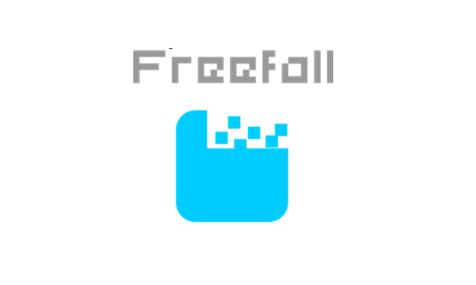
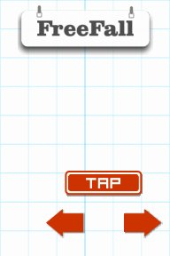
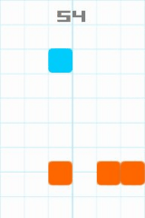

# Freefall-html5
Freefall in Phaser

## About
I decided to learn html5 game development by recreating one of my mobile games written in python and pygame. I use Phaser for this and try to stay as close as possible to the original gameplay of the original game (Freefall).

## Tools
Phaser Framework - [visit website](http://phaser.io.)

## Screenshots
 
 

## License
Freefall is licensed under the [MIT License](License.txt)

## Website
www.phyrebotcentral.com
